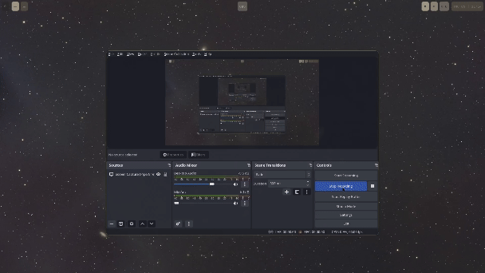
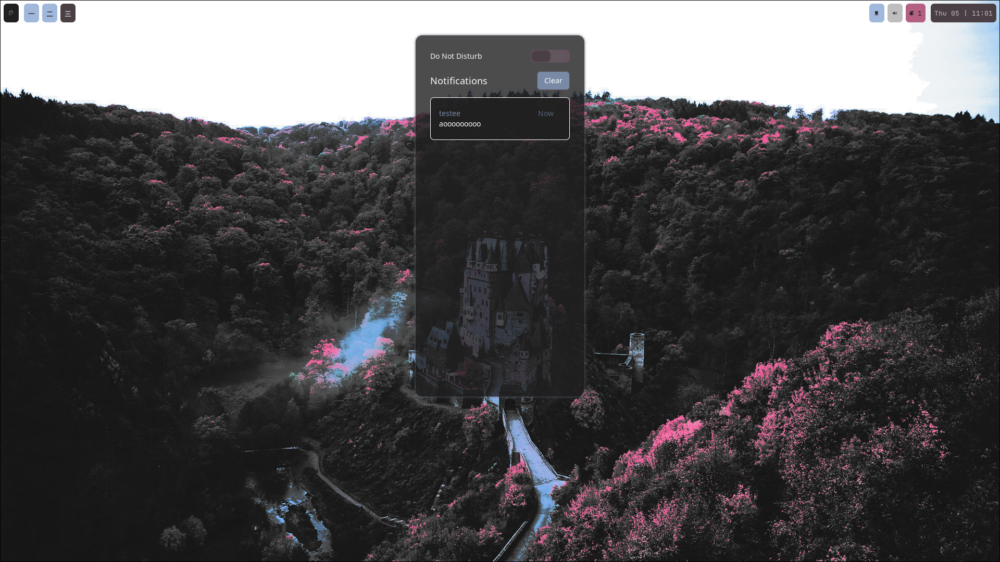
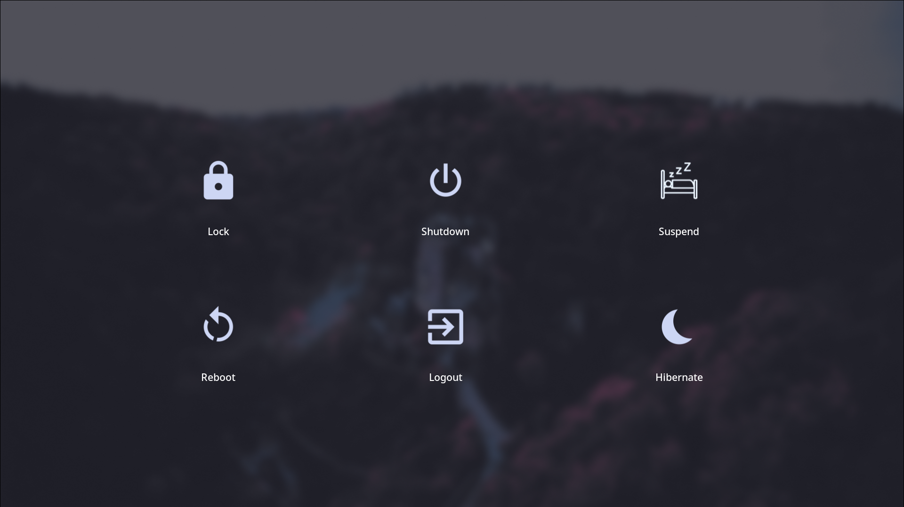

# My Hyprland rice on Debian 12
This is my first rice, but I got a good and stable result.

## Some things I used
- [Hyprland ](https://wiki.hyprland.org/Getting-Started/Installation/)(Window compositor)
- [Wallust](https://crates.io/crates/wallust) (for dynamic color palette based on wallpaper)
- [SWWW](https://github.com/LGFae/swww) (Wallpaper deamon)
- [JetBrains Nerd Font](https://github.com/ryanoasis/nerd-fonts/releases/download/v3.2.1/JetBrainsMono.zip)
- [Playerctl](https://github.com/altdesktop/playerctl) (CLI Audio util)
- [Pipewire](https://pipewire.org/) (multimedia framework)
- Custom scripts for audio management

## Keybinds
| Key  | Action  |
|  ---  |  ---  |
|  Super + X  |  Rofi (App selection)   |
|  Super + V  |  Clipse (Clipboard history)  |
|  Super + G  |  Google Chrome  |
|  Super + Q  |  Kitty terminal  |
|  Super + W  |  Wallpaper selection  |
|  Super + T  |  Waybar theme selection  |
|  Super + N  |  Notifications  |
|  Super + F12  |  Wlogout  |

#### Content management
| Key  | Action  |
|  ---  |  ---  |
|  Super + Space  |  Kill active app  |
|  Super + Arrows  |  Change focus  |
|  Super + Scroll or [0-9]  |  Switch to workspace  |
|  Super + Shift + [0-9]  |  Move app to workspace  |

#### Windows management
| Key  | Action  |
|  ---  |  ---  |
|  Super + P  |  Toggle pseudo float  |
|  Super + F  |  Toggle float  |
|  Super + J  |  Toggle split  |

#### Media keys
| Key  | Action  |
|  ---  |  ---  |
|  Super + Audio Play  |  Toggle play/pause  |
|  Super + Audio Mute  |  Toggle mute  |
|  Super + Audio Next  |  Next song  |
|  Super + Audio Prev  |  Previous song  |

## Demo

## License ?
Fully open source
