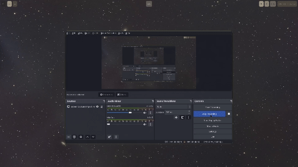
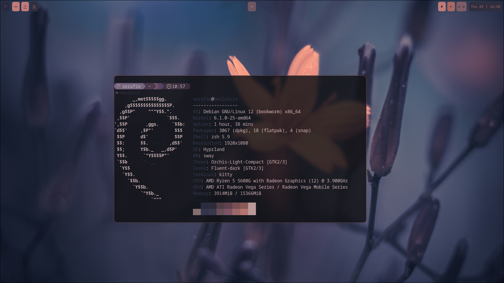
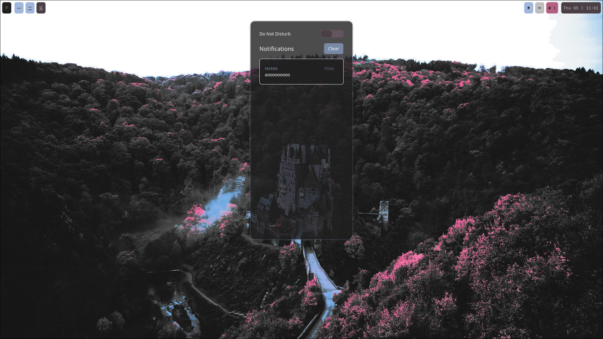
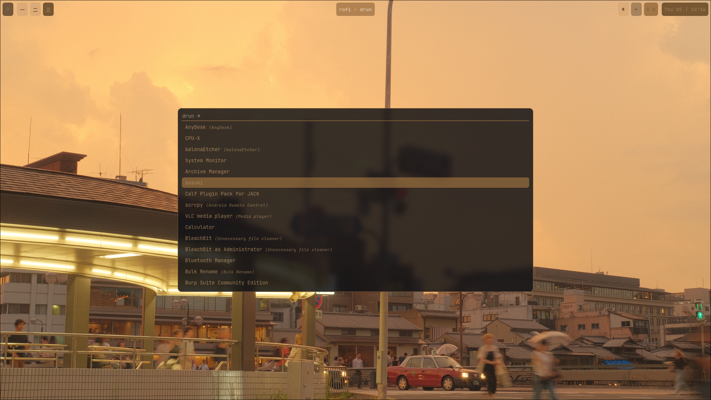
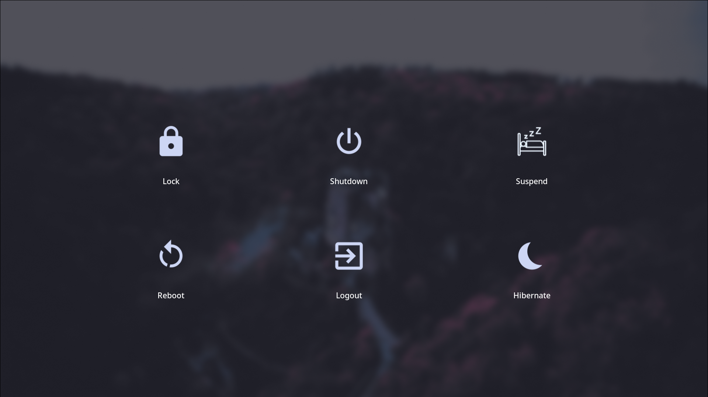

# My Hyprland rice on Debian 12
This is my first rice, but I got a good and stable result.

## Some things I used
- Hyprland (Window compositor)
- Wallust (for dynamic color palette based on wallpaper)
- SWWW (Wallpaper deamon)
- Custom scripts for audio management

## Demo

## License ?
Fully open source